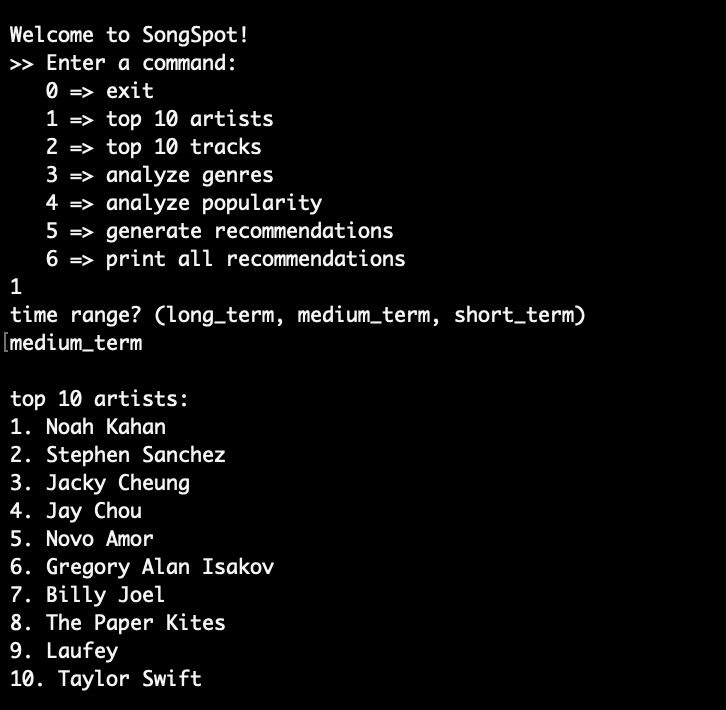
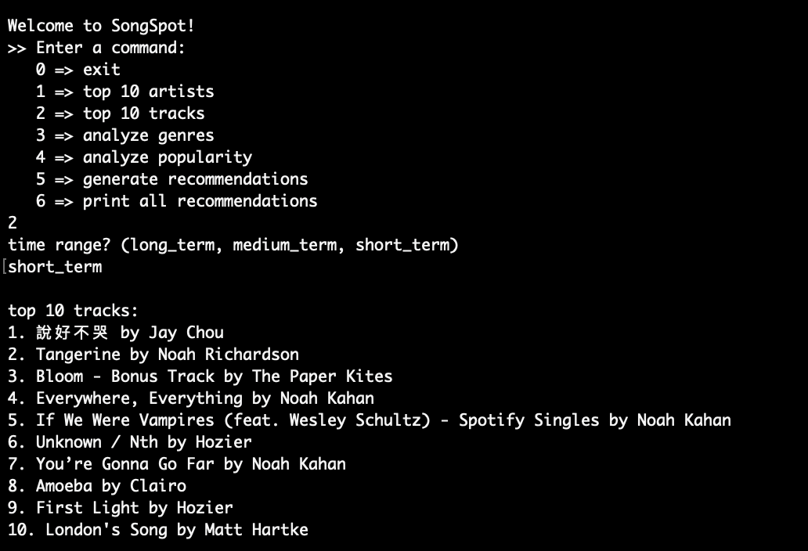
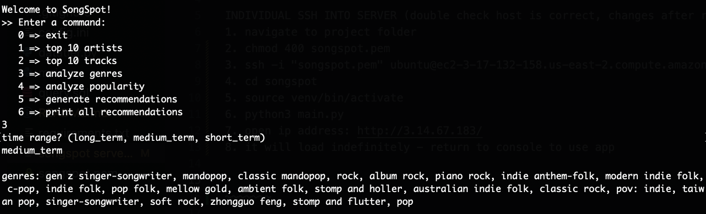
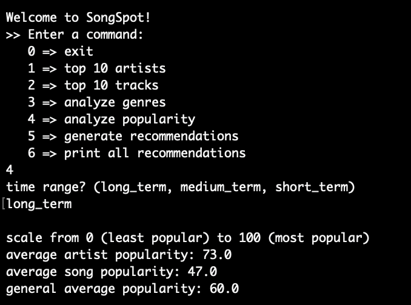
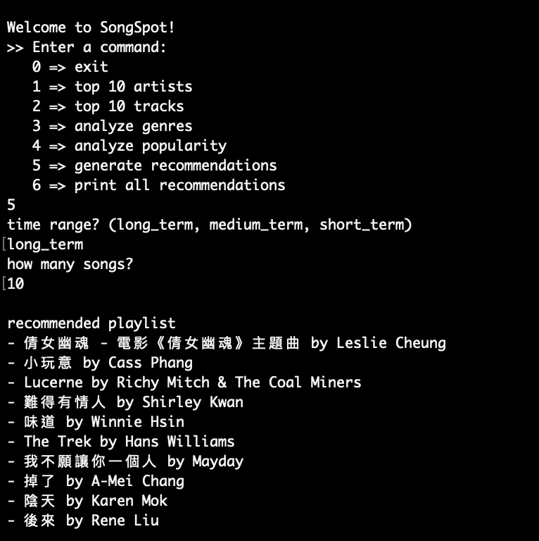
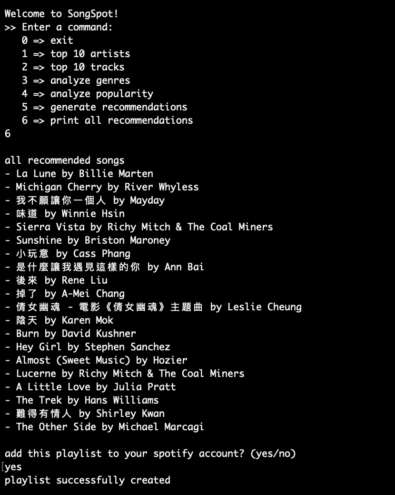

# SongSpot
### A Spotify Analyzer and Recommendations Generator
CS 310 Final Project (Last Updated: 06-02-2024)

## Functions

Using the SpotifyAPI, SongSpot completes 6 functions:
1. Prints out the user's top 10 artists
2. Prints out the user's top 10 tracks
3. Analyzes the genres of the user's music taste and prints out a list of their top genres
4. Computes the popularity of the user's music taste and prints out a popularity score
5. Generates a user-given number of recommendations
    - No song will be recommended twice in a given session
6. Prints out all songs recommended during the session, and optionally makes them a playlist in the user's Spotify account

Functions 1-5 have the option of analyzing different time ranges (long_term, medium_term, short_term.)

## Technical Details
- The program runs on a Flask application deployed to an EC2 server.
- The UI consists of simple print statements on the Flask client-side.
- Every function utilizes and interacts with the Spotify API and database.
- Functions 4-6 involve computation.
- Functions 5 and 6 utilize RDS.
    - In function 5, recommeded songs are stored in a database and referenced so that no songs are recommeded more than once in a given session
    - In function 6, all the songs recommended during the session are retrieved and printed out. The user can then choose to have SongSpot create a playlist in their account with these songs.

## SSH into server and launch project
1. in terminal, navigate to project folder (main directory that contains the the songspot.pem file)
2. `chmod 400 songspot.pem`
3. `ssh -i "songspot.pem" ubuntu@ec2-3-17-132-158.us-east-2.compute.amazonaws.com`
4. `cd songspot`
5. `source venv/bin/activate`
6. `python3 main.py`
7. in a browser, open ip address: http://3.17.132.158/
    1. if logging in as a new user, i will need to give your spotify account access to the application, please reach out to me.
8. it will load indefinitely - return to console to use app

## Demo
   
*command 1*

  
*command 2*

  
*command 3*

  
*command 4*

  
*command 5*

  
*command 6*